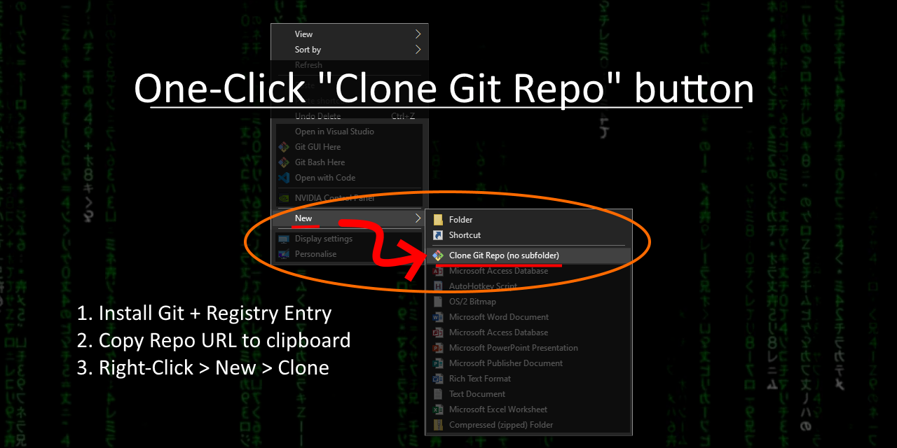

# New>Git (ContextMenu) [Windows]
## About
Add a right-click context menu option to quickly clone a Git Repo to this folder [Windows]
### Why?
I am cobbling this together because I couldn't find someone else's Git menu after an extensive **7-second google search**.
New default menus are a bit clunky, so If you have a Git-Menu already: let me know and I will surely share much love!

## Setup
1. Setup Git on your PC. *(install/configure/logins etc)*
1. Add `git.reg` to your registry by double-clicking it.
1. Profit!

## Usage
1. Right-click in a folder you want to clone a repo to.
1. Choose `New` **>** `Clone Git Repo`.
1. Paste in the the `https://*.git` URL.
> If you already have the URL on your clipboard, it will start the clone in 1-click!
---

---
## Enhancement Possibilities
Beyond the scope of this quickie, but maybe next rainy day:
- Replace default GIT desktop menu with more choices:
  - Clone here.
  - Clone as subfolder
  - New Git repo here
- SSH or other methods
- GUI for more options etc
